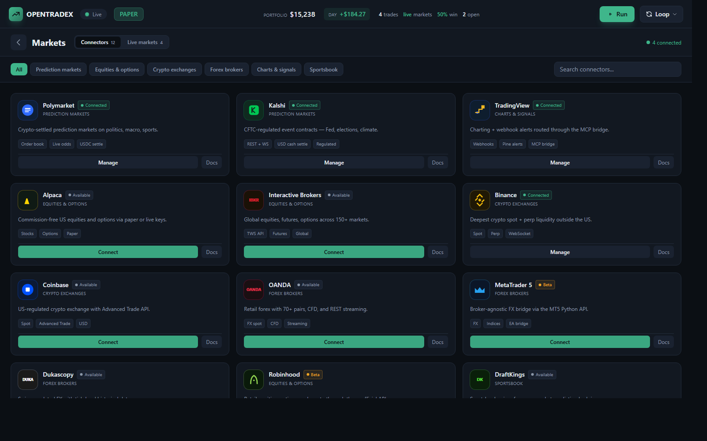
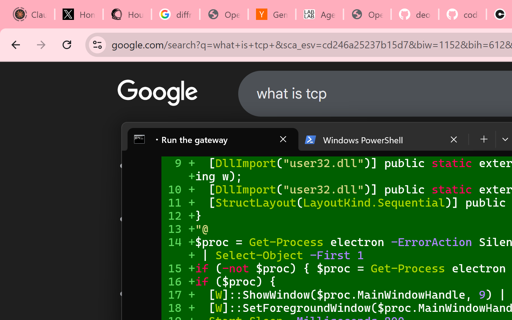

# OpenTradex — 60-second Quickstart

From zero to your first paper trade in under a minute. No accounts, no SaaS, no data leaves your machine.

---

## 1. Install

Pick one — all three land at the same cockpit.

### CLI (fastest)

```bash
npx opentradex onboard --paper-only && npx opentradex run
```

### Desktop

Download the signed installer for your OS from [**Releases**](https://github.com/deonmenezes/opentradex/releases):

- `OpenTradex-Setup-1.0.0.exe` — Windows (Authenticode-signed)
- `OpenTradex-1.0.0.dmg` — macOS (Developer ID + notarized)
- `OpenTradex-1.0.0.AppImage` — Linux

### Mobile

```bash
cd packages/mobile && npm install && npx expo start
```

Then open on your phone with Expo Go, or hit `i` / `a` for simulator.


---

## 2. Onboard

The wizard is the only step that writes secrets to disk. It lands in `~/.opentradex/config.json`.

```bash
opentradex onboard
```

You'll pick:

- **Mode** — `paper-only` (recommended), `paper-default`, or `live-allowed`
- **Bind mode** — `local` (127.0.0.1), `lan` (reach from phone), `tunnel` (public URL)
- **AI provider** — Anthropic, Google, OpenAI-compatible (Ollama/Groq/etc), or local Claude CLI
- **Connectors** — which rails you want to light up (Polymarket, Alpaca, Binance, etc.)

The wizard prints a **bearer token once**. Copy it — the mobile and desktop apps prompt for it on first launch.


---

## 3. Boot the gateway

```bash
opentradex run
```

The gateway binds `:3210` and serves:

- `GET /api/` — harness status
- `WS /ws` — live event stream (positions, trades, feed, markets)
- `/` — the web cockpit (React dashboard, bundled)

Open `http://localhost:3210` in a browser — the TopBar flips from `Connecting` to `Live` within a second.


---

## 4. Scan

In the center chat cockpit, type:

```
scan markets
```

or hit the **⚡ Cross-Market Scan** quick-start mission.

The harness hits every configured connector in parallel, runs each result through your AI model,
and streams ranked opportunities into the Market Scanner panel on the left.



---

## 5. Your first paper trade

Click any scanner row, or type in chat:

```
buy 1 contract of FED-SEP-CUT on kalshi at market
```

The AI proposes the trade, you approve with **Enter**, and the paper engine fills it.
The new position shows up in the left rail immediately, and the bottom TopBar equity updates.

To unwind:

```
close FED-SEP-CUT on kalshi
```

or hit the red **PANIC** button (desktop) / swipe-to-panic (mobile) to flatten everything at once.



---

## What next

- **Wire live** — re-run `opentradex onboard` and flip to `paper-default` (24h cooldown) then `live-allowed`.
- **Add a connector** — drop a file at `src/markets/<name>.ts` exporting `scan`, `quote`, `send`.
  The harness auto-discovers it on next boot.
- **Remote cockpit** — pick `lan` or `tunnel` during onboarding, open the mobile app, paste host + token.
- **Automate** — the gateway is plain HTTP. Curl it, call it from n8n, script it with anything.

```bash
curl -H "Authorization: Bearer $OPENTRADEX_TOKEN" http://localhost:3210/api/risk
```

---

## Troubleshooting

| Symptom | Fix |
|---|---|
| TopBar shows `Offline` | Gateway isn't running — `opentradex run` in another terminal |
| Scanner stays empty | No connectors configured — re-run `opentradex onboard` and light some up |
| Live trade throws | Mode is `paper-only` — by design. Re-onboard to flip |
| Mobile app won't pair | Check firewall on port 3210 and that you used the `lan` bind mode |
| `PANIC` button says cooldown | 10-second lockout after a panic fires — wait it out |

Stuck? Open an issue at [github.com/deonmenezes/opentradex/issues](https://github.com/deonmenezes/opentradex/issues).

---

**You're live.** Ship responsibly — this is paper-first for a reason.
